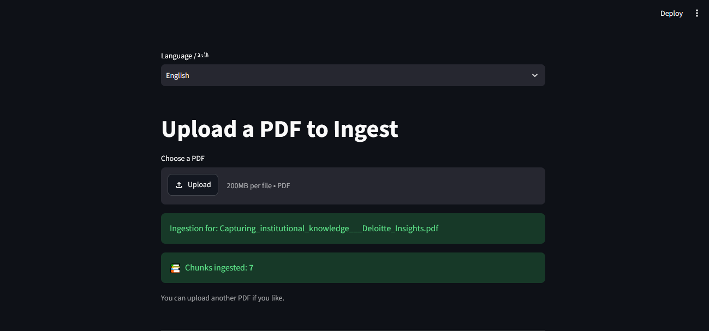
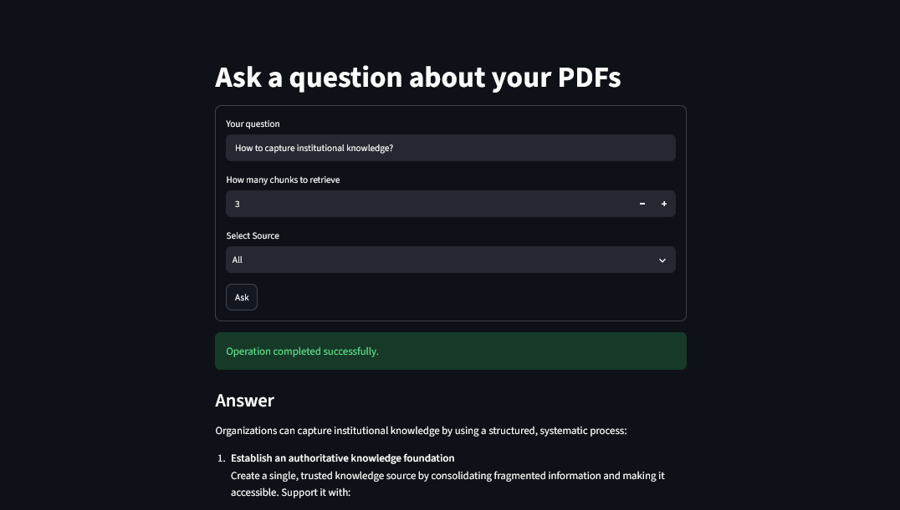
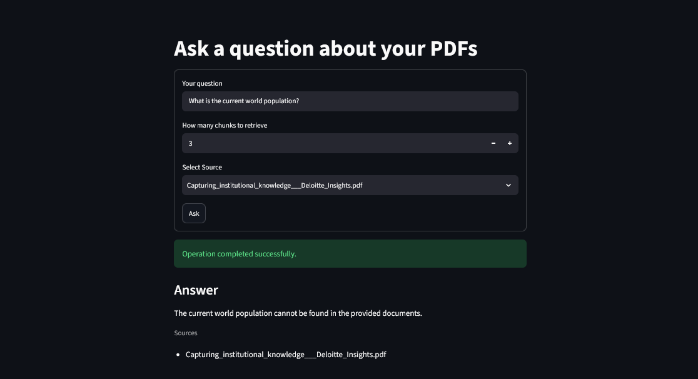

# 🗂️ Semantic Docs

A document-based **Retrieval-Augmented Generation (RAG)** application that allows users to upload documents, process and index their content into a PostgreSQL database using **pgvector**, and later ask questions against the stored knowledge base.

The application retrieves the most relevant document chunks for a user's question and sends those contexts to an **OpenAI LLM** to generate a grounded response.

The application UI supports both English and Arabic.







The sequence of steps happening under the hood is:

* **Uploading documents:** Chunking and indexing document content using `LlamaIndex`
* **Embedding:** Generating `OpenAI embeddings`
* **pgvector:** Storing embeddings and metadata in `PostgreSQL` using `pgvector`
* **Retrieving Knowledge:** Performing semantic similarity search
* **Context Selection:** Selecting the number of contexts (`top_k`) to retrieve
* **Document Filtering:** searching across the entire knowledge base or within a specific file
* **LLM:** Generating answers using an `OpenAI LLM`
* **Asynchronous/background processing:** Processing documents asynchronously in the background with `Inngest`
* **Backend:** `FastAPI`
* **Frontend:** `Streamlit`

---

## Architecture

At a high level, the application follows this flow:

```text
                    ┌─────────────────┐
                    │    Streamlit    │
                    │   Web Interface │
                    └────────┬────────┘
                             │
                    Upload / Ask Question
                             │
                             ▼
                    ┌─────────────────┐
                    │     FastAPI     │
                    │     Backend     │
                    └────────┬────────┘
                             │
                             ▼
                    ┌─────────────────┐
                    │     Inngest     │
                    │ Event / Workflow│
                    │   Orchestration │
                    └────────┬────────┘
                             │
                 ┌───────────┴───────────┐
                 │                       │
                 ▼                       ▼
        ┌─────────────────┐      ┌─────────────────┐
        │  RAG Ingestion  │      │    RAG Query    │
        │    Pipeline     │      │    Pipeline     │
        └────────┬────────┘      └────────┬────────┘
                 │                        │
                 ▼                        ▼
        ┌─────────────────┐      ┌─────────────────┐
        │   LlamaIndex    │      │   LlamaIndex    │
        │ Chunk + Index   │      │ Retrieve + Query│
        └────────┬────────┘      └────────┬────────┘
                 │                        │
                 ▼                        ▼
        ┌─────────────────┐      ┌─────────────────┐
        │ OpenAI          │      │    pgvector     │
        │ Embeddings      │      │ Semantic Search │
        └────────┬────────┘      └────────┬────────┘
                 │                        │
                 │                        │
                 ▼                        ▼
        ┌──────────────────────────────────────────┐
        │          PostgreSQL + pgvector           │
        │                                          │
        │   Chunks + Embeddings + Document         │
        │              Metadata                    │
        └────────────────────┬─────────────────────┘
                             │
                             ▼
                      Relevant Contexts
                             │
                             ▼
                    ┌─────────────────┐
                    │   OpenAI LLM    │
                    │  Answer Query   │
                    └────────┬────────┘
                             │
                             ▼
                    ┌─────────────────┐
                    │    Generated    │
                    │    Response     │
                    └─────────────────┘
```

---

## Features

### Document ingestion

Upload documents through the Streamlit interface. The backend processes the document, extracts its content, splits it into chunks, generates embeddings, and stores the resulting vectors alongside document metadata.

### Vector search

Each document chunk is converted into an embedding using an OpenAI embedding model.

The embeddings are stored in PostgreSQL using the `pgvector` extension, allowing the application to perform semantic similarity searches.

### Metadata storage

Along with the vector representation, document metadata is stored in the database.

This allows documents and their chunks to be identified and filtered during retrieval.

### Configurable `top_k`

When asking a question, the user can specify how many relevant chunks should be retrieved.

### File-specific retrieval

The user can choose between:

**Search entire knowledge base**

```text
Question
   ↓
Search all indexed documents
   ↓
Retrieve top_k relevant chunks
   ↓
Generate answer
```

or:

**Search a specific file**

```text
Question
   ↓
Filter by selected document
   ↓
Retrieve top_k relevant chunks
   ↓
Generate answer
```

This makes it possible to ask questions either across the entire document collection or about one particular document.

### RAG-powered responses

The retrieved chunks are provided as context to an OpenAI LLM.

The LLM can therefore answer questions using information retrieved from the user's uploaded documents.

---

# Tech Stack

| Technology            | Purpose                                                          |
| --------------------- | ---------------------------------------------------------------- |
| **FastAPI**           | Backend API                                                      |
| **Streamlit**         | Web UI                                                           |
| **Inngest**           | Background/event-driven document processing                      |
| **LlamaIndex**        | Document processing, chunking, indexing and retrieval components |
| **PostgreSQL**        | Persistent database                                              |
| **pgvector**          | Vector storage and similarity search                             |
| **OpenAI Embeddings** | Convert document chunks and queries into vectors                 |
| **OpenAI LLM**        | Generate answers from retrieved contexts                         |
| **Python**            | Application language                                             |

---

# Getting Started

Follow the steps below to run the project locally.

## 📋 Prerequisites

Make sure you have the following installed:

* [Python](https://www.python.org/) 3.10+
* [uv](https://docs.astral.sh/uv/) — Python package and project manager
* [Docker](https://www.docker.com/)
* Node.js / `npx` — required to run the Inngest development server
* An OpenAI API key

The project uses:

* **FastAPI** for the backend API
* **Streamlit** for the web interface
* **Inngest** for background document processing
* **LlamaIndex** for document processing and retrieval
* **PostgreSQL + pgvector** for storing embeddings and document metadata
* **OpenAI Embeddings** for generating vectors
* **OpenAI LLM** for generating answers

---

## 1. Clone the repository

Clone the project and move into the project directory:

```bash
git clone https://github.com/MohSalamh/Arabic-Rag.git
cd arabic-rag
```

---

## 2. Install dependencies with uv

This project uses [`uv`](https://docs.astral.sh/uv/) for Python environment and dependency management.

If you don't already have `uv` installed, follow the official installation instructions.

Create the virtual environment:

```bash
uv venv
```

Activate it:

### macOS / Linux

```bash
source .venv/bin/activate
```

### Windows

```powershell
.venv\Scripts\activate
```

Install the project dependencies:

```bash
uv sync
```

---

# 🗄️ 3. Start PostgreSQL with pgvector

The project uses PostgreSQL with the `pgvector` extension to store and search document embeddings.

The easiest way to run the database locally is with Docker.

From the project root, run:

```bash
docker run -d \
  --name pg_database \
  -e POSTGRES_PASSWORD=password \
  -p 5432:5432 \
  -v "$(pwd)/pg_data:/var/lib/postgresql/data" \
  pgvector/pgvector:pg17-trixie
```

This will:

* Create a PostgreSQL container named `pg_database`
* Expose PostgreSQL on port `5432`
* Set the PostgreSQL password to `password`
* Persist database files in the local `pg_data` directory
* Use the PostgreSQL 17 pgvector image

Check that the container is running:

```bash
docker ps
```

You should see `pg_database` in the list of running containers.

---

# 🔐 4. Configure environment variables

Create a `.env` file in the project root.

For example:

```env
OPENAI_API_KEY=your-openai-api-key

POSTGRES_PASSWORD=password
```

---

# ⚙️ 5. Start the FastAPI backend

Start the FastAPI application using Uvicorn.

For example:

```bash
uv run uvicorn app.main:app --reload
```

```text
http://127.0.0.1:8000
```

FastAPI's interactive API documentation should be available at:

```text
http://127.0.0.1:8000/docs
```

The application exposes the Inngest endpoint at:

```text
http://127.0.0.1:8000/api/inngest
```

Keep this terminal running.

---

# 🔄 6. Start the Inngest development server

Inngest is used to handle background/event-driven document processing.

Open a **new terminal** and run:

```bash
npx inngest-cli@latest dev -u http://127.0.0.1:8000/api/inngest --no-discovery
```

The `-u` option tells Inngest where the application's Inngest endpoint is located.

The `--no-discovery` option disables automatic service discovery and explicitly uses the URL provided above.

The Inngest development dashboard should be available at:

```text
http://localhost:8288
```

Keep this terminal running as well.

---

# 🖥️ 7. Start the Streamlit application

Open another terminal and start the Streamlit frontend.

For example:

```bash
uv run streamlit run frontend/streamlit_app.py
```

Streamlit should display a URL similar to:

```text
http://localhost:8501
```

Open that URL in your browser.

---

# 🧩 Running the Complete Application

For local development, you should have the following services running:

### Terminal 1 — PostgreSQL + pgvector

The database runs inside Docker:

```bash
docker ps
```

### Terminal 2 — FastAPI

```bash
uv run uvicorn app.main:app --reload
```

### Terminal 3 — Inngest

```bash
npx inngest-cli@latest dev -u http://127.0.0.1:8000/api/inngest --no-discovery
```

### Terminal 4 — Streamlit

```bash
uv run streamlit run streamlit_app.py
```

The overall local setup looks like:

```text
┌─────────────────────────┐
│       Streamlit         │
│      localhost:8501     │
└────────────┬────────────┘
             │
             ▼
┌─────────────────────────┐
│        FastAPI          │
│      localhost:8000     │
└────────────┬────────────┘
             │
             │ Inngest Events
             ▼
┌─────────────────────────┐
│        Inngest          │
│      localhost:8288     │
└────────────┬────────────┘
             │
             │ Document Processing
             ▼
┌─────────────────────────┐
│       LlamaIndex        │
│  Chunking + Indexing    │
└────────────┬────────────┘
             │
             │ OpenAI Embeddings
             ▼
┌─────────────────────────┐
│   PostgreSQL + pgvector │
│      localhost:5432     │
└─────────────────────────┘
```

---

# 🛑 Stopping the Application

The FastAPI, Inngest, and Streamlit processes can be stopped with:

```bash
Ctrl+C
```

To stop the PostgreSQL container:

```bash
docker stop pg_database
```

To start it again later:

```bash
docker start pg_database
```
Because the database is mounted to `./pg_data`, your PostgreSQL data will persist when the container is stopped or removed.

To remove the container:

```bash
docker rm -f pg_database
```

> Removing the container does not remove the local `pg_data` directory. The database data remains on your machine unless you explicitly delete that directory.

---

# OpenAI Models

The application uses OpenAI for two different purposes:

### Embeddings

Document chunks are converted into vector embeddings using an OpenAI embedding model.

```text
Document
   ↓
Chunking
   ↓
OpenAI Embedding Model
   ↓
Vector
   ↓
pgvector
```

The user's question is embedded using the same embedding space before performing the similarity search.

### LLM

After retrieving the relevant chunks, they are passed to an OpenAI language model along with the user's question.

```text
Question
    +
Retrieved Chunks
    ↓
OpenAI LLM
    ↓
Answer
```

The models can be configured through environment variables by setting `LLM_MODEL` and `EMBEDDING_MODEL` in the .env file.

---

# 📄 License

This project is licensed under the [MIT License](https://opensource.org/license/mit/).

---

# Acknowledgements

This project was inspired by a tutorial from [Tech With Tim](https://www.youtube.com/watch?v=AUQJ9eeP-Ls), which I used as a learning reference while exploring how to build a RAG application with FastAPI, LlamaIndex, and Streamlit.

The implementation in this repository was adapted and extended as a personal portfolio project. In particular, it uses **PostgreSQL with pgvector instead of Qdrant** for vector storage and includes additional functionality such as **source/document filtering**, and **Arabic and English language support in the user interface**.

